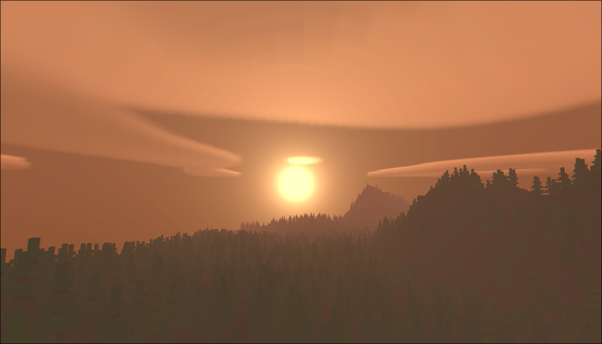

# ft_vox ⛏️
3D World generation using Voxels, similar to Minecraft
###### 🔧 Created by [DailyWind](https://github.com/DailyWind00) & [HaSYxD](https://github.com/HaSYxD) 🔧

#
### 🛠️ Compiling :
To compile the project, you must have CMake, Make and OpenGL, then you can do the following commands :
```shell
make         # Compile the project
make clean   # Remove the build Cmake folder
make fclean  # Remove the build Cmake folder and the executable
make wipe    # Remove the build Cmake folder, the executable and the dependencies folder
make re      # Recompile the project

# Then, to run the project, do :
./ft_vox [flags] [seed]

# You can display the help message and the list of available flags using :
./ft_vox --help
```
🚩 Here are the flags availables :
```shell
Flags :
    -h, --help        # Print the help message
    -v, --verbose     # Enable verbose mode
    -t, --no-tooltip  # Disable the commands tooltip
    -n, --no-caves    # Disable cave generation
    -p, --polygon     # Enable polygon rendering
```

#
### 🎮 Commands :
```shell
WASD         # Move the camera
Space        # Move up
Ctrl         # Move down
Mouse        # Look around
Shift        # Sprint
Left click   # Break block
Right click  # Place block
Esc          # Close the window
```

#
### Previews :
<p align="center">
  
  
  
</p>

###### Don't forget to leave a star ! 🌟